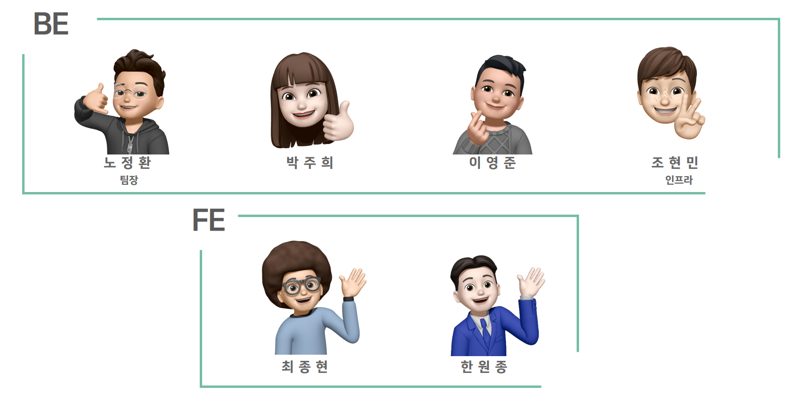
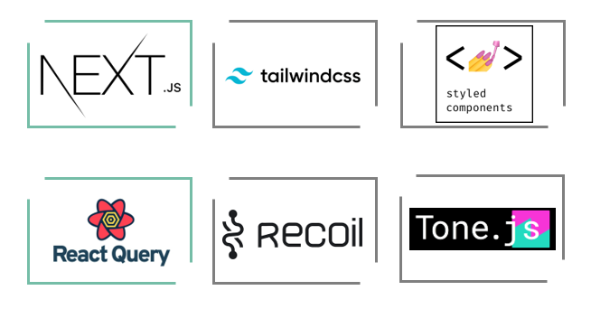
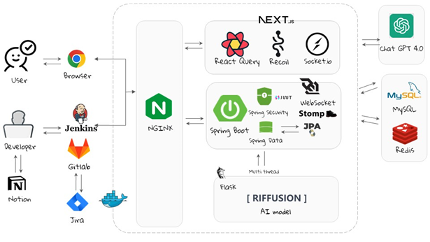
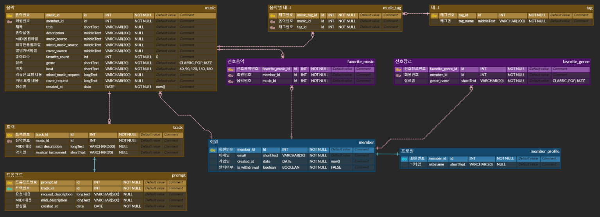
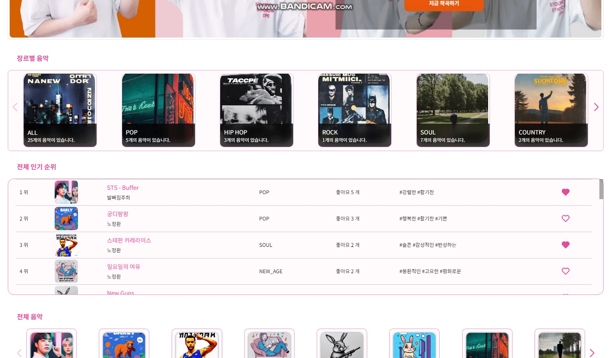
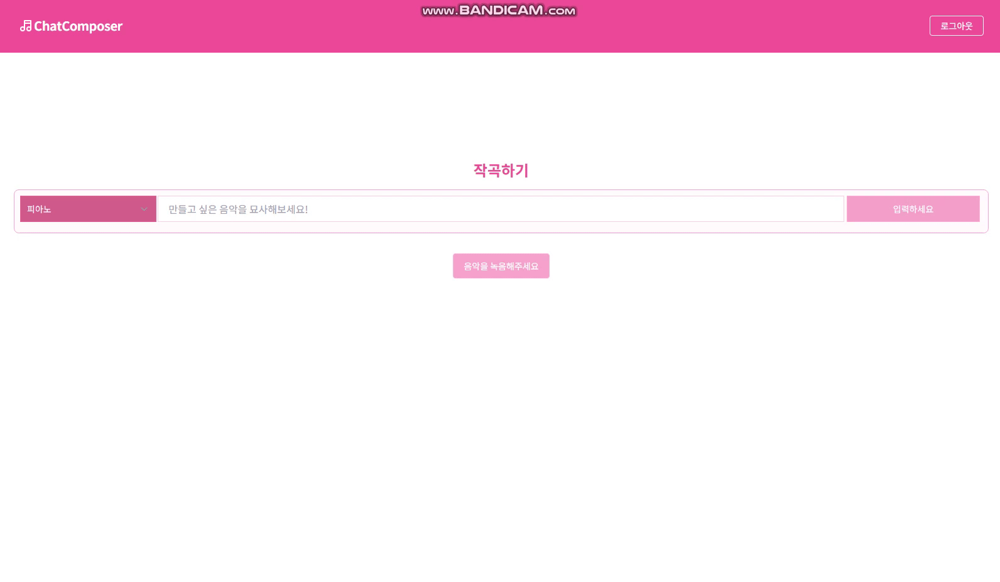
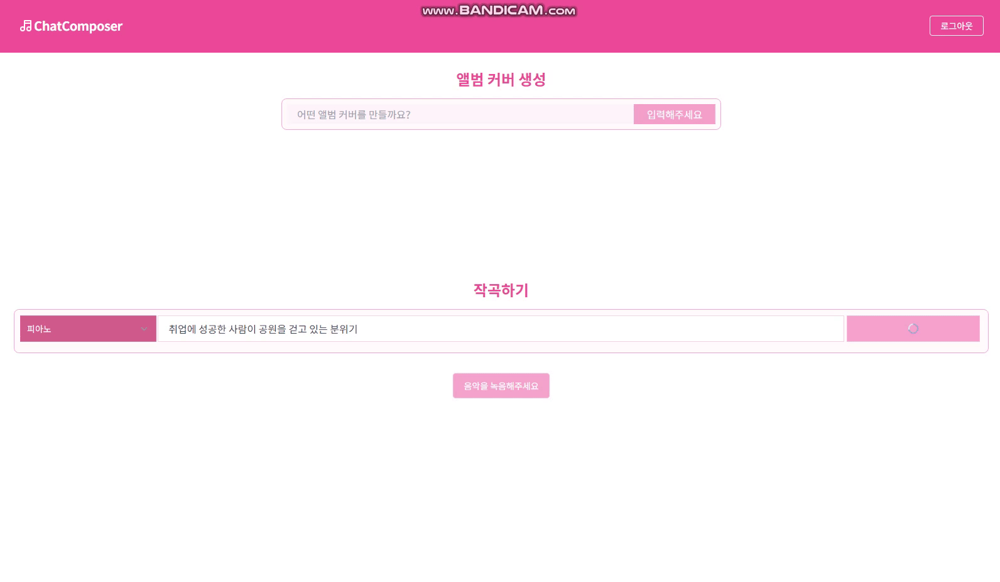
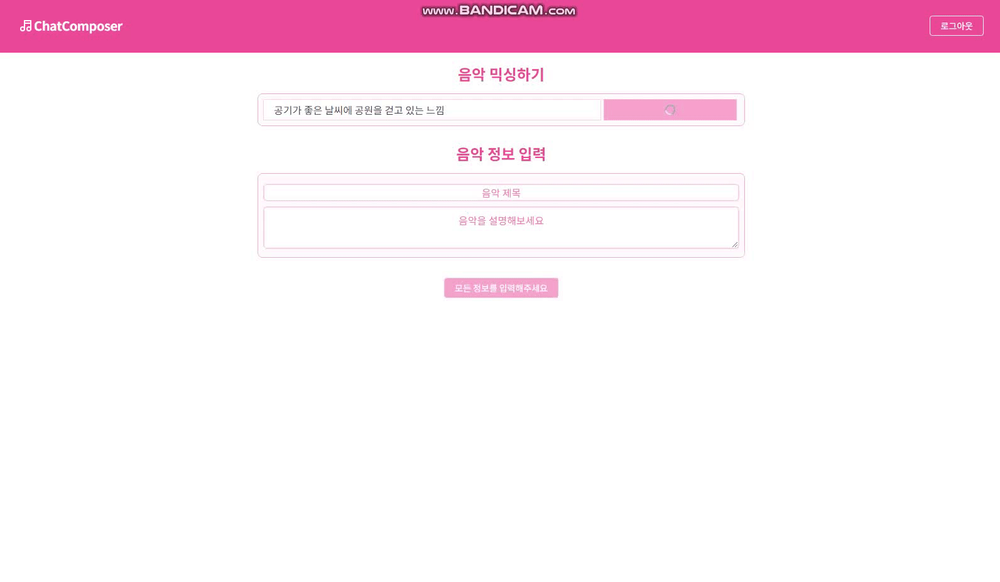

# :musical_keyboard: Chat Composer :musical_keyboard:

---

## :musical_note: 프로젝트 소개

---

Chat Composer는 생성형 AI Chat GPT를 활용하여 이용자가 채팅을 통해 음악과 커버 이미지를 생성할 수 있는 프로젝트입니다. 작곡에 관련된 이론과 DAW 사용법을 모르는 사람도 간단하게 음악을 만들 수 있습니다.

## 

## :musical_note: 프로젝트 기간

---

2023.04.10(월) ~ 2023.05.19(금)

## 

## :musical_note: 참여 인원 및 역할 분담

---

**Back-End**

- 노정환 : 팀장 | 최종 발표 | DB설계 | API 명세 | 소셜 로그인

- 박주희 : 백엔드, 인프라 담당 | CI/CD 파이프라인 구축 | DB설계 | API 명세 | 음악(Music), 태그(Tag) 관련 API 구현 | 포팅매뉴얼 작성

- 이영준 : 인공지능 담당 | Stable Diffusion 모델 분석 및 테스트 | 앨범 커버 관련 FastAPI 프로젝트 구현 | Produce API 구현(S3, 인공지능 API) | RabbitMQ Java 구현 | UCC 기획 및 제작

- 조현민 : 인공지능 담당 | AI 모델 분석 | 데이터셋 전처리 | 모델 학습 및 테스트 | GPU서버 배포 | 음악모델 서빙

**Front-End**

- 최종현 : ChatGPT API 생성 | Tone.JS를 이용한 음악 생성 | 디자인 | 중간 발표

- 한원종 : 소셜 로그인 구현 | Readme 작성 | PPT 제작

## 

## :musical_note: 기술 스택

---

**Back-End**    

**Front-End**

**일정관리**

## 

## :musical_note: 개발 환경

---

**Back-End**

- Springboot : 2.7.8
- Java : zulu 11.0.18
- IntelliJ IDEA 2022.3.1 (Ultimate Edition)
- MySQL : 8.0.32a
- spring security
- JPA
- redis
- JWT
- S3

**Front-End**

- next.js : 13.4
- recoil : 0.7.7
- react-query : 4.29.5
- typescript : 4.7.4
- tone.js : 14.7.77
- tailwind css : 0.5.3

## 

## :musical_note: 아키텍처

---

 

## :musical_note: ERD

---

## 

## :musical_note: 기능 소개

---

