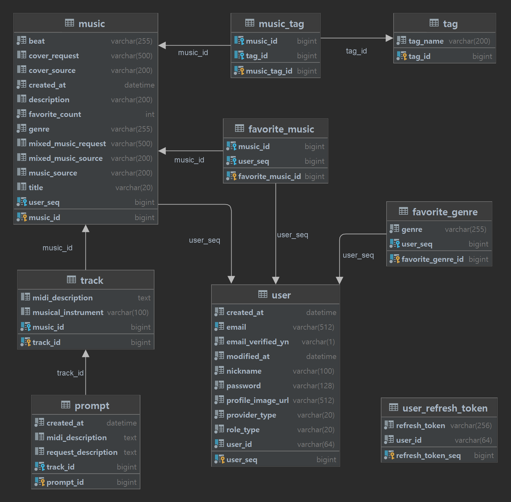

# :musical_keyboard: Chat Composer :musical_keyboard:

 

## :musical_note: 프로젝트 소개

Chat Composer는 생성형 AI Chat GPT를 활용하여 이용자가 채팅을 통해 음악과 커버 이미지를 생성할 수 있는 프로젝트입니다.

작곡에 관련된 이론과 DAW 사용법을 모르는 사람도 간단하게 음악을 만들 수 있습니다.

 

## :musical_note: 프로젝트 기간

2023.04.10(월) ~ 2023.05.19(금) : 6주

 

## :musical_note: 참여 인원 및 역할 분담

| Name   | Position                                                                                                                                                                            |
| ------ | ----------------------------------------------------------------------------------------------------------------------------------------------------------------------------------- |
| 노정환 | `Back-End` 팀장 / DB 설계 / API 명세 / 소셜 로그인 / 최종 발표                                                                                                                      |
| 박주희 | `Back-End` 인프라 담당 / DB 설계 / API 명세 / 음악(Music), 태그(Tag) 관련 API 구현 / CI/CD 파이프라인 구축 / 포팅매뉴얼 작성                                                        |
| 이영준 | `Back-End` 인공지능 담당 / Stable Diffusion 모델 분석 및 테스트 / 앨범 커버 관련 FastAPI 프로젝트 구현 / Produce API 구현(S3, 인공지능 API) / RabbitMQ Java 구현 / UCC 기획 및 제작 |
| 조현민 | `Back-End` 인공지능 담당 / AI 모델 분석 / 데이터셋 전처리 / 모델 학습 및 테스트 / GPU서버 배포 / 음악모델 서빙 / 포팅매뉴얼 작성                                                    |
| 최종현 | `Front-End` ChatGPT API 생성 / Tone.JS를 이용한 음악 생성 / 디자인 / 중간 발표                                                                                                      |
| 한원종 | `Front-End` 소셜 로그인 구현 / Readme 작성 / PPT 제작                                                                                                                               |
|        |

 

## :musical_note: 기술 스택

**Back-End**

**Front-End**

**일정관리**

 

## :musical_note: 개발 환경

**Back-End**

-   IntelliJ IDEA 2022.3.1 (Ultimate Edition)
-   Java : zulu 11.0.18
-   Springboot : 2.7.11
-   spring security : 5.7.8
-   JWT : 0.11.5
-   MySQL : 8.0.33
-   redis : 7.0.11
-   JPA
-   S3

**Front-End**

-   next.js : 13.4
-   recoil : 0.7.7
-   react-query : 4.29.5
-   typescript : 4.7.4
-   tone.js : 14.7.77
-   tailwind css : 0.5.3

 

## :musical_note: 아키텍처

## :musical_note: ERD

 

## :musical_note: 기능 소개

### 메인 페이지

-   구글 소셜 로그인 후 서비스 이용 가능

:white_check_mark: 예시 산출물 : /docs/BBAMBBAM.mp3

### 음악 인기 순위

-   전체, 장르별 음악의 인기순위 확인

### 음악 작곡하기

-   장르와 태그 선택

 

### 작곡하기

-   원하는 프롬프트를 입력하여 음악 트랙 생성

### 앨범 커버 생성

-   원하는 프롬프트를 입력하여 이미지 생성

### 작곡하기

-   트랙 추가 : 다른 악기의 트랙 작곡하기
-   녹음하기 : 생성된 모든 트랙이 재생되며 트랙 합치기

### 음악 믹싱하기

-   음악 리퓨전

### 음악 정보 입력

-   제목과 설명을 입력하면 음악 등록 완료

### 공유된 음악 감상

-   음악 재생으로 다른 사용자가 공유한 음악 감상

### 음악 좋아요

-   마음에 드는 음악에 좋아요를 누르면 인기 순위에 반영

